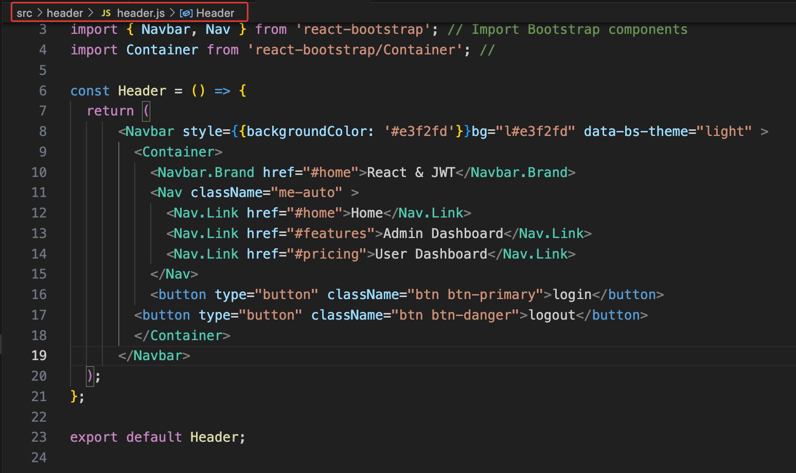

### 1 -  Start - Installing Create React App package 

The first thing we have to install is Node.js and with npm install
we have to install the third party library.

 
   Using Visual Code Editor
  1.1 -  Install next extension `Simple React Snippet`

  1.2 -  Install Prettier Code Formattor

  

### 2 -  Create the App

In terminal run with npm start

We will delete all files inside the source folder.
Let's create a new folder `header` and inside `header.js` and `header.css`

Now let's use Header component in new created App component.
Create app.js file in ./src/...

In index.js let's render the ui 

### 3 -  Install Bootstrap and React Bootstrap

Install bootstrap and react-bootstrap
Remove header.css previously created file and remove `import "./header.css";` in `header.js`
 

Edit `header.js` file

### 4 -  Routing - Configure the paths

step 1 - Install `react-router-dom` if you haven't already:

step 2 - Check if you have a `BrowserRouter` wrapping your application. This is usually done in your main `index.js`

step 3 - Use `Link` component for navigation:
Replace the `href` attribute with the `to` prop provided by `Link`:
